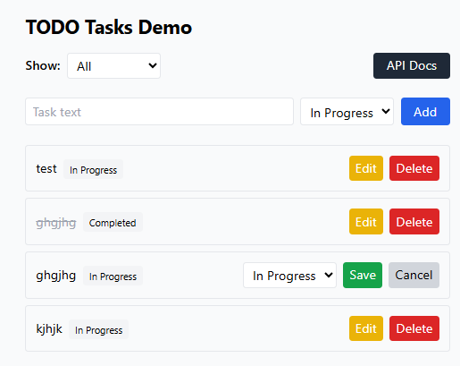
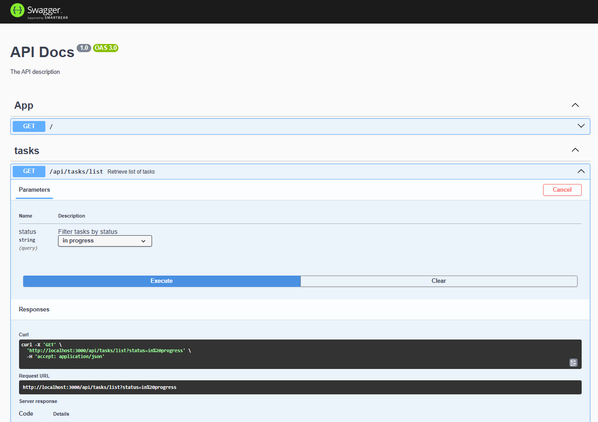
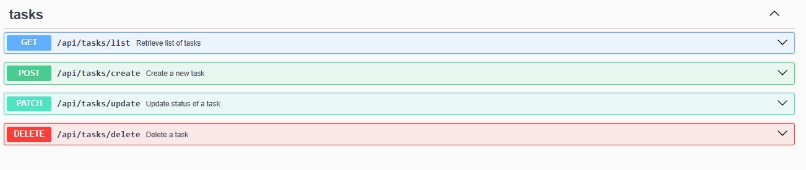

# TODO Platform

Modern full-stack TODO application built with NestJS and React.

## 🚀 Quick Start Guide

### 1. Clone Repository
```bash
git clone git@github.com:NikitaLipovich/todo_interview.git
cd todo_interview
```

### 2. Build Docker Image
```bash
docker build -t todo-test .
```

### 3. Run Container
```bash
docker run -p 3000:3000 -p 5173:5173 todo-test
```

### 4. Access Application

#### Frontend (React App)
🌐 **Frontend URL:** [http://localhost:5173](http://localhost:5173)



#### Backend API Documentation (Swagger)
📚 **Swagger API Docs:** [http://localhost:3000/api-docs](http://localhost:3000/api-docs)

Swagger UI provides interactive API documentation where you can:
- Browse all available endpoints
- Test API requests directly in the browser
- Explore data structures and request parameters
- Get server response examples





## 🏗️ Project Structure
```
todo_interview/
├── backend/          # NestJS API server
├── frontend/         # React application with Vite
├── Dockerfile        # Multi-stage Docker build
├── README.md         # Project documentation
└── .gitignore        # Git ignore rules
```

## 🛠️ Tech Stack
- **Backend:** NestJS (TypeScript), SQLite with TypeORM
- **Frontend:** React + TypeScript, Tailwind CSS, Vite
- **Documentation:** OpenAPI/Swagger
- **Deployment:** Docker

## 📋 API Endpoints

Base URL: `http://localhost:3000`  
All task endpoints are prefixed with `/api/tasks`

### Get Tasks
```
GET /api/tasks/list
```
**Query Parameters:**
- `status` (optional): Filter by status (`in progress` | `completed`)

**Example:**
```bash
curl "http://localhost:3000/api/tasks/list"
curl "http://localhost:3000/api/tasks/list?status=completed"
```

### Create Task
```
POST /api/tasks/create
```
**Request Body:**
```json
{
  "text": "Buy groceries",
  "status": "in progress"
}
```

**Example:**
```bash
curl -X POST "http://localhost:3000/api/tasks/create" \
  -H "Content-Type: application/json" \
  -d '{"text": "Buy groceries", "status": "in progress"}'
```

### Update Task Status
```
PATCH /api/tasks/update
```
**Request Body:**
```json
{
  "id": 1,
  "status": "completed"
}
```

**Example:**
```bash
curl -X PATCH "http://localhost:3000/api/tasks/update" \
  -H "Content-Type: application/json" \
  -d '{"id": 1, "status": "completed"}'
```

### Delete Task
```
DELETE /api/tasks/delete
```
**Request Body:**
```json
{
  "id": 1
}
```

**Example:**
```bash
curl -X DELETE "http://localhost:3000/api/tasks/delete" \
  -H "Content-Type: application/json" \
  -d '{"id": 1}'
```

## 📊 Task Status Values
- `in progress` - Task is being worked on
- `completed` - Task is finished

## 🗄️ Database
- **Type:** SQLite
- **Location:** `backend/tasks.db` (auto-created)
- **ORM:** TypeORM with automatic synchronization

## 🛠️ Development Mode

### Backend Development
```bash
cd backend
yarn install
yarn start:dev  # Hot reload on http://localhost:3000
```

### Frontend Development
```bash
cd frontend
yarn install
yarn dev  # Vite dev server on http://localhost:5173
```

## 🐳 Docker Architecture

The application uses multi-stage Docker builds:

1. **Backend Build Stage:** Compiles TypeScript to JavaScript
2. **Frontend Build Stage:** Builds React app for production  
3. **Production Stage:** Serves both applications

**Container Services:**
- Backend: NestJS server on port 3000
- Frontend: Static files served on port 5173
- Both services start automatically
